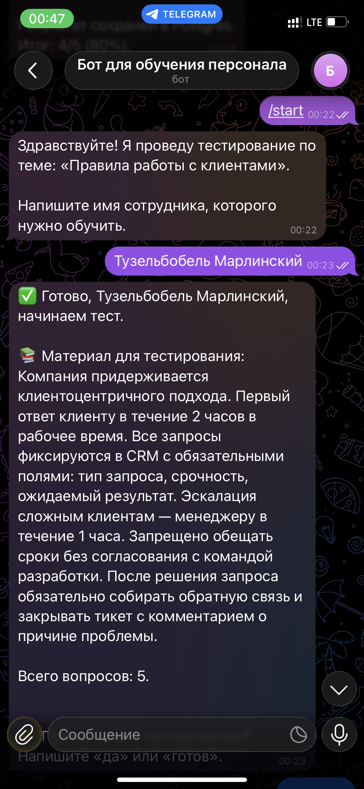
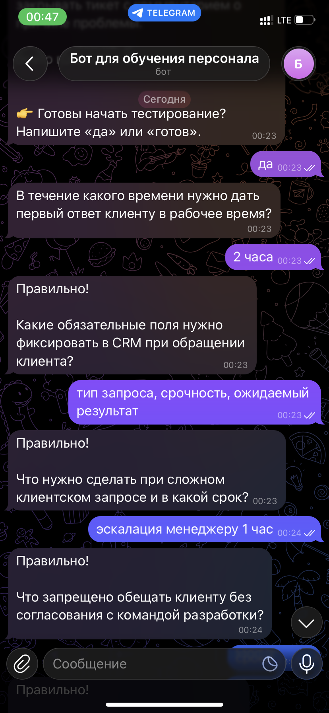
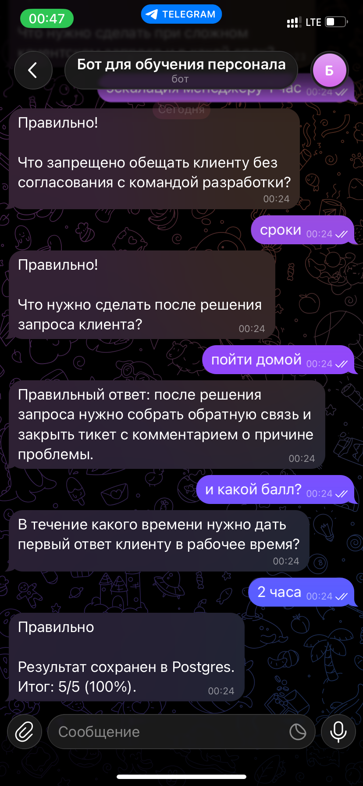
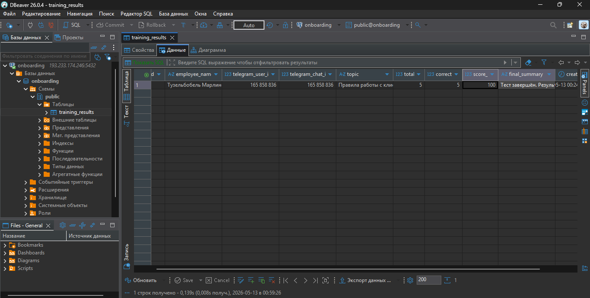

<div align="center">

# 🤖 AI Training Bot


**Telegram-бот для тестирования сотрудников по корпоративным регламентам**

[Описание](#-описание-проекта) • [Бизнес-цель](#-бизнес-цель) • [Технологии](#-технологии) • [Архитектура](#-архитектура) • [Скриншоты](#-скриншоты) • [Установка](#-установка-и-настройка) • [Деплой](#-деплой-на-vds) • [Заключение](#-заключение) • [Лицензия](#-лицензия) • [Контакты](#-контакты)

</div>

---

## 📋 Описание проекта

**AI Training Bot** — это Telegram-бот для автоматизированного тестирования сотрудников по корпоративным регламентам и правилам работы. Бот показывает учебный материал, задаёт вопросы по одному, оценивает ответы и сохраняет результаты в PostgreSQL.

> **Текущий кейс:** «Правила работы с клиентами» — конкретизированный сценарий для отдела продаж. Бот встроен в бизнес-процесс продаж, что повышает ценность проекта для коммерческого использования.

### Основные возможности

- 📱 **Telegram-интерфейс** — обучение и тестирование в привычном мессенджере
- 📚 **Показ материала** — перед тестом бот демонстрирует учебный контент
- ❓ **Тестирование** — вопросы по одному, оценка ответов в реальном времени
- 💾 **Сохранение результатов** — фиксация итогов в PostgreSQL для отслеживания прогресса
- 🔄 **Гибкая настройка** — передача любого материала через переменные окружения
- 🚀 **Простой деплой** — Docker Compose, запуск на VDS за 10 минут

### Практическая ценность

Ассистент можно настроить под собственные задачи: передать нужный материал, сформулировать промпт и использовать для изучения любой предметной области. Система последовательно подаёт учебный материал, проводит тестирование, фиксирует результаты в отдельной таблице и позволяет отслеживать динамику прогресса.

---

## 🎯 Бизнес-цель

**Проблема:** Отделы продаж и поддержки тратят десятки часов на онбординг новых сотрудников. Обучение проводится вручную, результаты тестирования не фиксируются, прогресс невозможно отследить.

**Решение:** Telegram-бот сокращает время на обучение с 2–3 часов до 15–20 минут за счёт автоматической подачи материала, тестирования и фиксации результатов. Методика стандартизирована, данные сохраняются в БД для аналитики.

**Целевая аудитория:**
- Отделы продаж (онбординг менеджеров)
- Службы поддержки (обучение регламентам)
- HR-департаменты (корпоративное обучение)
- Франшизы (масштабирование обучения)

---

## 🛠 Технологии

| Категория | Технологии |
|-----------|------------|
| **Язык программирования** | Python 3.12+ |
| **Telegram Bot** | aiogram 3.7+ (async) |
| **LLM & Embeddings** | OpenAI GPT-5.4-mini (ProxyAPI) |
| **Основная БД** | PostgreSQL 15+ (asyncpg, SQLAlchemy 2.0) |
| **Конфигурация** | Pydantic Settings v2 |
| **Инфраструктура** | Docker, Docker Compose |
| **Развёртывание** | VDS (Ubuntu 24.04), SSH |

---

## 🏗 Архитектура

```
┌─────────────────────────────────────────────────────────────┐
│                   Telegram Client                           │
│                    (пользователь)                           │
└──────────────────────────┬──────────────────────────────────┘
                           │
                           ▼
┌─────────────────────────────────────────────────────────────┐
│              AI Training Bot (Python + aiogram)             │
│                                                             │
│  ┌─────────────────┐    ┌─────────────────┐                 │
│  │  FSM States     │    │  Handlers       │                 │
│  │  • active       │    │  • /start       │                 │
│  │  • waiting      │    │  • /cancel      │                 │
│  │    for readiness│    │  • text         │                 │
│  └─────────────────┘    └────────┬────────┘                 │
│                                  │                          │
│         ┌────────────────────────┼────────────────┐         │
│         ▼                        ▼                ▼         │
│  ┌──────────────┐    ┌──────────────┐   ┌──────────────┐    │
│  │ Training     │    │ AI Training  │   │ Logging      │    │ 
│  │ Service      │    │ Service      │   │ Middleware   │    │
│  │ (session     │    │ (LLM         │   │              │    │
│  │  management) │    │  calls)      │   │              │    │
│  └──────────────┘    └──────┬───────┘   └──────────────┘    │
│                             │                               │
└─────────────────────────────┼───────────────────────────────┘
                              │
              ┌───────────────┴───────────────┐
              ▼                               ▼
    ┌─────────────────┐             ┌─────────────────┐
    │   PostgreSQL    │             │  ProxyAPI.ru    │
    │   (training     │             │  (OpenAI API)   │
    │    results)     │             │                 │
    └─────────────────┘             └─────────────────┘
```

---

## 📸 Скриншоты

### Команда /start и показ материала



### Процесс тестирования



### Итог теста



### Результат сохранения в PostgreSQL



---

## 🚀 Установка и настройка

### Предварительные требования

- Python 3.12+
- Docker Desktop
- API-ключ OpenAI (ProxyAPI)
- Токен Telegram-бота (от [@BotFather](https://t.me/BotFather))

### Клонирование репозитория

```bash
git clone <repository-url>
cd onboard
```

### Создание виртуального окружения

```bash
python -m venv .venv
.venv\Scripts\activate        # Windows
source .venv/bin/activate     # Linux/macOS
```

### Установка зависимостей

```bash
pip install -r requirements.txt
```

### Настройка переменных окружения

```bash
copy .env.example .env
```

Отредактируйте `.env`, внеся свои значения

### Запуск базы данных (Docker)

```bash
docker compose up -d db
```

### Запуск бота

```bash
python main.py
```

---

## 📡 Деплой на VDS

### 1. Собрать образ локально

```powershell
docker build -t onboard-bot .
docker save onboard-bot -o onboard-bot.tar
```

### 2. Передать на сервер

```powershell
scp onboard-bot.tar root@193.233.174.246:/root/
scp .env root@193.233.174.246:/root/
```

### 3. На сервере запустить

```bash
ssh root@193.233.174.246

# Загрузить образ
docker load < /root/onboard-bot.tar

# Запустить PostgreSQL
docker run -d \
  --name db \
  -e POSTGRES_DB=onboarding \
  -e POSTGRES_USER=postgres \
  -e POSTGRES_PASSWORD=postgres \
  -p 5432:5432 \
  postgres:16-alpine

# Запустить бота
docker run -d \
  --name bot \
  --env-file /root/.env \
  --link db:db \
  --restart unless-stopped \
  onboard-bot

# Проверить
docker ps
docker logs -f bot
```

---

## 📁 Структура проекта

```
onboard/
├── main.py                          # Точка входа
├── requirements.txt                 # Зависимости
├── .env.example                     # Шаблон переменных окружения
├── docker-compose.yml               # Запуск БД (Docker)
├── Dockerfile                       # Образ для Docker
├── README.md                        # Документация
│
├── config/
│   ├── __init__.py
│   └── settings.py                  # Pydantic Settings
│
├── bot/
│   ├── __init__.py
│   ├── main.py                      # Инициализация бота
│   ├── keyboards/
│   │   ├── __init__.py
│   │   └── common.py                # Клавиатуры (cancel, remove)
│   └── handlers/
│       ├── __init__.py
│       └── onboarding.py            # Основной хендлер (FSM)
│
├── database/
│   ├── __init__.py
│   ├── models.py                    # SQLAlchemy ORM
│   ├── db.py                        # Engine + Session
│   └── repository.py                # Репозиторий результатов
│
├── services/
│   ├── __init__.py
│   ├── training_service.py          # Управление сессией
│   ├── ai_training_service.py       # Вызов LLM
│   └── ai_training_prompts.py       # Системный промпт
│
├── schemas/
│   ├── __init__.py
│   └── training.py                  # Pydantic модели (draft, turn)
│
├── docs/
│   └── images/                      # Скриншоты
│
└── tests/                           # Тесты (опционально)
```

---

## 🎯 Заключение

**AI Training Bot** — готовое решение для автоматизации корпоративного обучения. Бот интегрирован в Telegram, что устраняет барьер внедрения (не нужно устанавливать отдельное приложение).

**Ключевые преимущества:**
- Сокращение времени на обучение с 2–3 часов до 15–20 минут
- Стандартизированная методика тестирования для всех сотрудников
- Сохранение результатов для аналитики и отслеживания прогресса
- Гибкая настройка под любую предметную область через переменные окружения
- Простой деплой на VDS за 10 минут

**Масштабирование:** Проект можно расширять за счёт добавления новых тем обучения, интеграции с CRM для автоматической фиксации результатов, генерации отчётов для руководителей.

---

## 📄 Лицензия

MIT License — подробности в файле [LICENSE](LICENSE)

---

## 📞 Контакты

**Автор:** Ivan P  
**Telegram:** [@nonoyessure](https://t.me/nonoyessure)  

---

<div align="center">

**⭐ Ставьте звезду, если проект полезен!**

🚀

</div>
